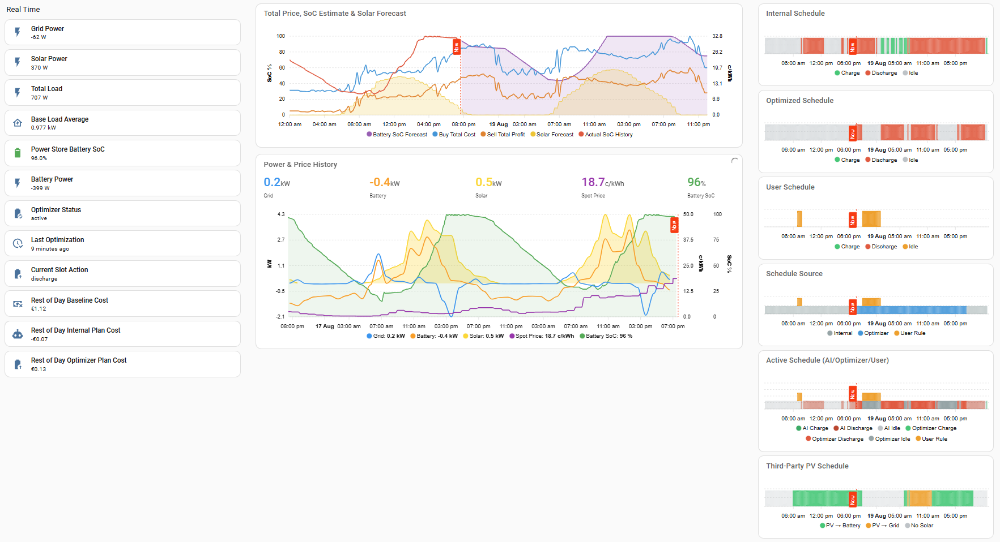
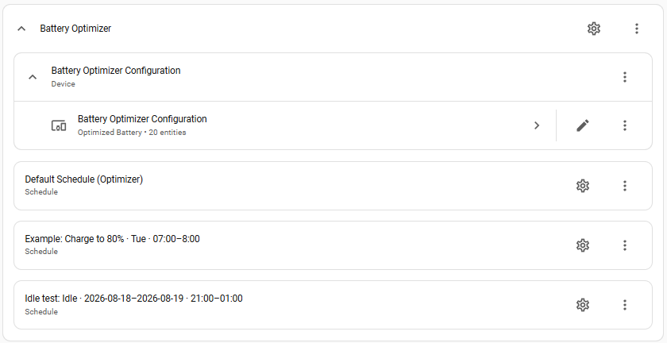
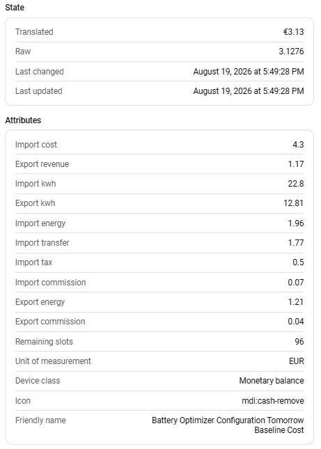
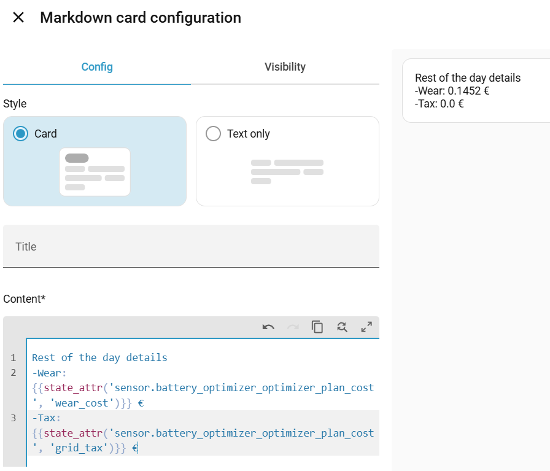

# Emaldo Battery Optimizer — Home Assistant Custom Integration

[](https://github.com/wertigpar/ha-battery-optimizer/releases)
[](https://github.com/wertigpar/ha-battery-optimizer/blob/main/LICENSE)
[](https://github.com/hacs/integration)
[](https://github.com/wertigpar/ha-battery-optimizer/actions/workflows/validate.yml)

[](https://my.home-assistant.io/redirect/hacs_repository/?owner=wertigpar&repository=ha-battery-optimizer&category=integration)



A Home Assistant custom integration that optimizes Emaldo battery charge/discharge schedules based on electricity spot prices, solar PV forecasts, and battery state. It generates a 96-slot (15-minute resolution) daily schedule and pushes it to a battery system via a rolling 24-hour E2E override window. Integration is mainly built to work together with Emaldo Home Assistant custom component.

## How It Works

```
 ┌──────────────┐   ┌──────────────┐   ┌──────────────┐
 │  Spot Price  │   │   Solcast    │   │  Battery SoC │
 │   Sensor     │   │  PV Forecast │   │   Sensor     │
 └──────┬───────┘   └──────┬───────┘   └──────┬───────┘
        │                  │                  │
        └──────────┬───────┴──────────────────┘
                   ▼
          ┌─────────────────────────────────────┐
          │          Greedy Optimizer           │
          │             (optimizer.py)          │
          │  • 96-slot battery schedule         │
          │  • thirdparty_pv_slots[96] (bool)   │
          └────────────┬──────────────┬─────────┘
                       │              │
           ┌───────────▼──┐   ┌───────▼────────────────┐
           │   Emaldo     │   │  switch.power_store_   │
           │ apply_bulk_  │   │  third_party_pv         │
           │  schedule    │   │  (PV sell strategy)     │
           └──────────────┘   └─────────────────────────┘
```

**Optimization strategy (greedy, self-consumption model):**

The Emaldo battery load-matches during discharge — it covers household load
only and does not export to grid. Discharge value therefore equals the grid
buy price avoided (self-consumption), not the sell/export price.

1. Identify solar surplus slots — battery idle mode absorbs excess PV for free.
2. Rank non-solar slots by buy price (most expensive first for discharge).
3. Discharge existing energy when `buy_price > wear_cost` (self-consumption saves money).
4. Round-trip trades when the price spread covers efficiency losses + wear.
5. **Night-pool reservation on COMBINED days**: on no/partial-solar days the
   discharge budget runs evening → morning → night, so the cheapest night
   slots are starved even though the battery holds stored energy. A
   reservation bias (hardcoded default 0.6, module constant
   `_NIGHT_RESERVE_BIAS` in `optimizer.py`) reserves a slice of the initial
   battery pool — scaled by `bias × solar_refill_fraction / 0.95` — for the
   cheapest pre-solar night slots **before** the main buy-desc pass runs
   (cheapest first, so the starved slots are covered). The remaining budget
   allocates buy-desc as before; the over-commit correction keeps the plan
   above the floor. Bias 0 = legacy behavior (no reservation). On top of that,
   **plateau night drain** still probes day profit vs starting SoC and drains
   dead stored energy above the plateau edge overnight — never below the
   edge. Skipped when the plan starts after solar onset.
6. Grid charge only the deficit that solar + existing SoC cannot cover.
7. **PV sell strategy** (optional): when enabled, computes a parallel `thirdparty_pv_slots[96]` plan. A single cutover time T (≤ noon by default) is chosen through an iterated simulation of the true battery need at the cutover (the plan-start SoC understates the gap caused by the sell window). Solar before T is sold to the grid (PV switch OFF) only where the sell price beats the **stored value** of that kWh — the cheapest future discharge buy price discounted by round-trip efficiency and `pv_sell_margin` (exporting only beats storing because a stored kWh displaces a future grid buy); solar from T onward charges the battery uninterrupted.

**Smart override logic:**

The optimizer compares its plan against the battery's internal AI schedule (read from the Emaldo integration). Only slots where the optimizer disagrees with the battery's internal plan are overridden. Matching slots are left to follow the internal schedule (value 128 = no override). The schedule is pushed as a rolling 96-slot E2E packet: positions at or after the current time-of-day slot carry today's plan, while positions before it carry tomorrow's plan (when available). After overrides are applied, the Emaldo schedule state is refreshed from the battery.

## Prerequisites

| Requirement | Details |
|---|---|
| **Home Assistant** | 2024.1+ |
| **Emaldo integration** | Must be installed and configured. The optimizer calls `emaldo.apply_bulk_schedule` to push the schedule. Battery SoC and balancing state are auto-discovered from the selected Emaldo entry. |
| **Spot price sensor** | Required only when **Price data source** is set to `sensor`. A sensor with a `data` attribute containing 15-minute price entries (e.g. an Entso-E / Nordpool integration). See [Price Sensor Format](#price-sensor-format). When using `emaldo` (default), prices come from the Emaldo integration automatically. |
| **Solcast PV integration** *(optional)* | [Solcast PV Forecast](https://github.com/BJReplay/ha-solcast-solar) with `detailedForecast` attribute on today/tomorrow sensors. If not available, solar production is assumed zero. |

> **Note — Emaldo internal solar forecast:** The Emaldo `schedule_chart` entity (`sensor.power_store_schedule_chart`) contains a `solar` field per slot, but this data is only populated when the Emaldo device is configured as a model that supports solar (e.g. **Store+Solar** or **3rd Party PV enabled**). When the device model is **Store** with **3rd Party PV = off**, the Emaldo backend does not provide solar forecast data and the `solar` field is always zero. This means Emaldo's internal solar forecast **cannot be used as a Solcast replacement** in that configuration. Any future feature that reads solar data from Emaldo must first check whether the device model/configuration actually supplies it, and fall back to zero (or Solcast) if not.

## Installation

### HACS (recommended)

1. Open Home Assistant **HACS → Integrations → Explore & Download Repositories**.
2. Search for **"Battery Optimizer for Emaldo Home Battery"** and click **Download**.
3. Restart Home Assistant.
4. Go to **Settings → Devices & Services → Add Integration → Battery Optimizer**.

### Manual

1. Copy the `battery_optimizer` folder into your Home Assistant `custom_components/` directory:

   ```
   custom_components/
   ├── battery_optimizer/
   │   ├── __init__.py
   │   ├── brand/                  # logos + icons (HACS branding)
   │   ├── button.py
   │   ├── config_flow.py
   │   ├── const.py
   │   ├── coordinator.py
   │   ├── manifest.json
   │   ├── optimizer.py
   │   ├── rules.py
   │   ├── runtime_state.py
   │   ├── sensor.py
   │   ├── services.py
   │   ├── services.yaml
   │   ├── solar_actual.py
   │   ├── solar_scale.py
   │   ├── strings.json
   │   ├── switch.py
   │   └── translations/           # da, en, fi, nb, sv
   └── emaldo/
       └── ...
   ```

2. Restart Home Assistant.

3. Go to **Settings → Devices & Services → Add Integration → Battery Optimizer**.

## Configuration

All parameters are set through the UI config flow. No YAML configuration needed.

### Config Flow Fields

| Field | Description | Default |
|---|---|---|
| **Price data source** | Where to read spot prices from. `emaldo` = use Emaldo's internal Nord Pool data (no extra sensor needed, 15-min resolution). `sensor` = use an external price sensor. | `emaldo` |
| **Spot price sensor** | Entity ID of your electricity price sensor. Only used when **Price data source** is `sensor`. | `sensor.electricity_prices` |
| **Solcast today sensor** | Entity ID of the Solcast today forecast sensor | `sensor.solcast_pv_forecast_forecast_today` |
| **Solcast tomorrow sensor** | Entity ID of the Solcast tomorrow forecast sensor | `sensor.solcast_pv_forecast_forecast_tomorrow` |
| **VAT multiplier** | VAT multiplier applied to spot price when buying (1.255 = 25.5% Finnish VAT) | `1.255` |
| **Grid transfer fee** | Transfer fee added to buy price (€/kWh) | `0.0776` |
| **Sales commission** | Commission deducted from sell price (€/kWh) | `0.003` |
| **Battery capacity** | Total battery capacity in kWh | `15.0` |
| **Max charge power** | Maximum charge rate in kW | `10.0` |
| **Max discharge power** | Maximum discharge rate in kW | `10.0` |
| **Charge efficiency** | Charge efficiency (0.5–1.0) | `0.9` |
| **Discharge efficiency** | Discharge efficiency (0.5–1.0) | `0.9` |
| **Min SoC** | Minimum allowed state of charge (%) | `20` |
| **Max SoC** | Maximum allowed state of charge (%) | `100` |
| **Base household load** | Estimated constant household load in kW. Used when auto-tune is disabled. | `1.0` |
| **Battery wear cost** | Cost per kWh cycled (€/kWh) — accounts for battery degradation. Typical LFP: 1–5 snt/kWh. | `0.03` |
| **Idle power consumption** | Constant power draw of the battery unit itself (kW). Drains SoC even when idle. | `0.1` |
| **Auto-tune base load** | When enabled, the optimizer computes base load from recorder history instead of using the static value above. | `false` |
| **Household load power sensor** | Entity ID of a combined household load power sensor in Watts (e.g. `sensor.combined_power`). Required when auto-tune is enabled. | *(empty)* |
| **Idle slot strategy** | Controls what happens for slots where the optimizer has no action (see below). | `full_control` |
| **SoC guard interval** | How often (minutes) to actively update the discharge floor marker. See [SoC Guard](#soc-guard). | `0` (disabled) |
| **Emaldo battery device** | Emaldo config entry to use. Shown as a dropdown — select the correct system when multiple Emaldo devices are installed. | first found |
| **Enable PV sell strategy** | Initial default for the live `switch.battery_optimizer_pv_strategy` entity. When `true`, the optimizer will plan PV-to-grid slots on sunny days instead of always charging the battery. See [PV Sell Strategy](#pv-sell-strategy). | `false` |
| **Min solar forecast for PV sell** | Minimum Solcast forecast (kWh) required to activate PV sell strategy. Below this threshold the strategy is skipped (cloudy day guard). | `10.0` |
| **Solar forecast mode** | Which Solcast percentile to use for charge planning. `p10` (default) uses the pessimistic 10th-percentile forecast — weather-aware, causes the optimizer to add more grid charge slots on cloudy/uncertain days. `p50` uses the median, which can leave the battery undercharged when actual solar is lower than expected. | `p10` |
| **Solar forecast scale** | Whole-day multiplier applied to the solar forecast before planning. `0` (default) = auto-tune from the accuracy history (see [Plan Accuracy](#plan-accuracy)); e.g. `0.8` scales the forecast down by 20% when it over-predicts. Manual values are clamped to 0.3–1.2. | `0` (auto) |
| **Actual solar sensor** | Entity ID of a cumulative energy counter for actual PV production (e.g. daily inverter yield, Wh or kWh). Used for plan-vs-actual accuracy and the solar-scale auto-tune instead of the Emaldo-internal estimate (balance-derived, distorted by household loads). Empty (default) = Emaldo-internal estimate. | *(empty)* |
| **Grid import sensor** | Entity ID of a cumulative energy counter for grid import (Wh or kWh) — the basis for the Realized Cost sensors. **Empty (default) = auto-detect** the linked Emaldo unit's `grid_import_today` sensor (model-agnostic, works for any Emaldo model). Override with a lifetime meter (e.g. an EM24 `_total` counter) for a non-Emaldo or cloud-free install. | *(empty — auto)* |
| **Grid export sensor** | Entity ID of a cumulative energy counter for grid export (Wh or kWh) — the basis for the Realized Cost sensors. **Empty (default) = auto-detect** the linked Emaldo unit's `grid_export_today` sensor (model-agnostic, works for any Emaldo model). Override with a lifetime meter (e.g. an EM24 `_total` counter) for a non-Emaldo or cloud-free install. | *(empty — auto)* |
| **SoC floor safeguard** | When enabled, the optimizer forces a grid charge back to `soc_min + buffer` whenever the actual SoC drops below that floor (battery would otherwise miss the evening peak after a solar shortfall). | `true` |
| **SoC recovery buffer** | Percentage of capacity reserved above `soc_min` as the dischargeable bottom edge. A planned run never ends below `soc_min + buffer`, so it never reaches the floor with no idle-drain headroom. | `5.0` |
| **Optimizer re-run interval** | How often (minutes) the optimizer re-runs to refresh the schedule: 15, 30, 60, or 120. | `120` |

> **Internal PV-sell tuning constants** (not UI-configurable — edit the `BatteryConfig` dataclass defaults in `optimizer.py` to change): `pv_sell_solar_margin` (default `0.95`, minimum fraction of needed solar energy required to allow selling), `pv_sell_min_price_spread` (default `0.0`, absolute sell-price floor in €/kWh — selling also requires the sell price to exceed the slot's stored value), `pv_sell_margin` (default `1.0`, multiplier on the stored-value sell threshold — `1.05` requires a 5% premium over storage before exporting), `solar_forecast_margin` (default `0.85`, fraction of discharge-slot surplus solar credited to the grid-charge balance).

All parameters can be changed later via **Settings → Devices & Services → Battery Optimizer → Configure**.

### Idle Slot Strategy

When the optimizer decides a slot should be "idle" (no charge/discharge), the strategy setting controls how that idle instruction is sent to the Emaldo battery:

| Strategy | Value | Behaviour |
|---|---|---|
| **Full control** | `full_control` | Force idle (SLOT_IDLE = 0x00) for **all** idle slots. The optimizer fully controls the battery 24/7 — the internal AI never acts on its own. **Default and recommended.** |
| **Solar guard** | `solar_guard` | Force idle only for slots **before** the first solar production of the day. After solar starts, idle slots are left as "no override" (0x80) letting the internal AI decide. Prevents overnight grid charging while giving the AI freedom during/after solar hours. |
| **Smart override** | `smart_override` | Force idle only when **both** conditions are met: (1) the internal AI plans to **charge** at that slot, and (2) solar production is expected later in the day. Most targeted — only blocks the specific problematic case of pre-solar grid charging that the AI initiates. |

> **Background:** The Emaldo battery has an internal AI that makes its own charge/discharge decisions. When the optimizer sends `SLOT_NO_OVERRIDE` (0x80), the internal AI is free to act — which can lead to unwanted overnight grid charging that fills the battery before solar production arrives. The `full_control` strategy prevents this by explicitly forcing the battery idle for slots the optimizer doesn't need.

> **Note — dashboard chart semantics under Full control:** The `sensor.battery_optimizer_schedule_chart` entity renders the optimizer's *current* plan, which starts at the slot the plan was last computed. Slots that have already elapsed carry `action: "none"` and are shown as `value: null` / `past: true`. This is expected: nothing is pushed retroactively for past slots, and it does **not** mean the internal AI took control of them. At the time each slot was in the active rolling window, Full control did push `SLOT_IDLE` (0x00) for every idle slot. To confirm enforcement on a live install, either check the log line `Pushing rolling 96-slot schedule to Emaldo: N overrides` (under Full control, `N` covers essentially all remaining slots), or inspect a **future** idle slot in the chart — it shows `action: "idle"`, `value: 0`.

### User Schedule Layer

Users can define persistent schedule rules that override the optimizer
for specific time windows. Rules are managed via **Settings → Devices &
Services → Battery Optimizer → subentries** (Add / edit / delete). No
YAML, no helpers.

**Rule levels (precedence, strongest first):**

| Level | Example | Notes |
|---|---|---|
| **Specific date** | `18.8.2026 19:45 – 19.8.2026 01:15` | May cross midnight and span multiple days; middle days covered fully |
| **Weekday** | `Mon–Fri 07:00–17:00` | Single-day only — no midnight crossing (make two rules) |
| **Default** | every day, all day | Always present, editable, effectively non-deletable; initial action = `optimizer` |

Same-level overlapping rules are rejected at creation. Date rules always
beat weekday rules, which beat the default rule.

**Actions:**

| Action | Battery behavior | Emaldo byte |
|--------|------------------|-------------|
| `charge@N%` | Charge from grid to N % | `N` |
| `idle` | No grid draw; absorb solar surplus | `0` |
| `discharge@N%` | Discharge when load > solar; absorb solar otherwise | `256−N` |
| `original` | Follow the battery's internal AI | `128` |
| `optimizer` | Use the optimizer's plan for the slot | *(computed)* |

**PV behavior** (per rule, effective when the PV Sell Strategy switch is
ON): `inherit` (follow the optimizer's PV plan), `sell` (export solar to
grid), `charge` (solar charges the battery).

**SoC floor example:** to never discharge below 40 % in the evening but
allow 15 % in the morning (solar about to start), add a weekday rule
`17:00–23:00 → discharge@40` and a weekday rule `06:00–09:00 →
discharge@15`. With SoC Guard enabled, the discharge floor rotates
accordingly.



**Dashboard:** the `sensor.battery_optimizer_user_schedule_chart` sensor
exposes the user plan (summary state + `schedule[]` attribute with
`source` per slot, spanning today **and** tomorrow to align with the other
schedule charts). See [Dashboard chart — User Schedule](#dashboard-chart--user-schedule)
for a ready-made card, and add the user as an extra series to the
Schedule Source chart (`source == 'user'`).

### Pause / Resume a rule

Each schedule rule gets its own enable switch (`switch.<your rule label>_rule_enabled`,
translation key `rule_enabled`). Flip it off to **pause** the rule — the optimizer stops
applying it, but your settings stay intact, so you can resume later without re-entering them.
Disabled rules are skipped when the optimizer builds the plan, exactly like a rule you deleted,
but without losing the configuration. The toggle is also offered as an `enabled` checkbox inside
the rule editor.

> **Note:** the *PV Sell Strategy* (`pv_sell`) selector only appears in the rule editor when the
> rule action is **Charge** or **Discharge**. For *Force Idle*, *Idle Slot Strategy*, or
> *Optimizer (Control)* the field is hidden, because those actions never sell surplus solar.

### SoC Guard

The Emaldo battery uses a single global "Battery Range" setting (high/low markers) that applies to **all** discharge slots simultaneously. This means per-slot discharge thresholds (e.g. "discharge to 75% at 17:00, then to 60% at 19:00") cannot be achieved through the slot values alone — the firmware treats `high_marker` as a global discharge floor.

The SoC Guard feature works around this limitation by **actively rotating the discharge floor** at a configurable interval:

| Interval | Value | Behaviour |
|---|---|---|
| **Disabled** | `0` | No SoC guard — discharge uses the default markers. **Default.** |
| **15 min** | `15` | Update the discharge floor every 15 minutes |
| **30 min** | `30` | Update every 30 minutes |
| **60 min** | `60` | Update every hour |
| **120 min** | `120` | Update every 2 hours |

**How it works:**

At each interval tick, the optimizer looks forward in the current schedule by the interval duration and finds the lowest planned discharge SoC within that window. It then sets `high_marker` to that value, preventing the battery from discharging below the planned floor — even if unexpected loads appear.

**Example** (30-minute interval):
- **16:30** — Plan says discharge to 75% by 17:00 → sets `high_marker = 75`
- **17:00** — Plan says discharge to 60% by 17:30 → sets `high_marker = 60`
- **17:30** — No discharge planned → sets `high_marker = soc_min` (most permissive)

**Use case:** The sauna kicks on at 16:45 during what should be a moderate discharge window. Without SoC Guard, the battery could empty to `soc_min` due to the sudden load spike. With guard enabled at 30-min interval, the discharge stops at 75% — preserving energy for the planned evening peak discharge.

The current SoC guard marker is exposed in the **Optimizer Status** and **Schedule Chart** sensor attributes as `soc_guard_marker`.

### Auto Base Load

When **Auto-tune base load** is enabled, the optimizer queries the HA recorder for 14 days of daily statistics from the configured **Household load power sensor** (W), computes a 7-day rolling average, and uses that as the base load for every optimization run.

**How it works:**

1. At each optimizer run, `statistics_during_period` is called for the load sensor with `"day"` bucket and `"mean"` statistic.
2. Daily mean values (W) are converted to kW. Days with no positive data are skipped.
3. The most recent 7 days of daily average kW are averaged.
4. The result is clamped to ±50% of the configured static base load (to limit the effect of anomalous days).
5. The final value is applied for this run and exposed on the **Auto Base Load** sensor.

**Falls back to the static `base_load_kw` if:**
- Auto-tune is disabled
- No sensor is configured
- The recorder component is unavailable
- Fewer than 3 days of data exist

**Recommended sensor:** `sensor.combined_power` — a template sensor that calculates actual household consumption from all sources:
```
grid_power - battery_power + solar_power  (in Watts)
```

### Plan Accuracy

The **Plan Accuracy** sensor compares planned vs actual energy (discharge,
charge, solar) for the slots elapsed since the last optimizer run. Its state
is the signed discharge error in kWh; its attributes carry the full per-run
breakdown (`planned_*_kwh`, `actual_*_kwh`, `*_error_kwh`).

Since HA's recorder strips sensor attributes, the per-run values would
normally be lost after the next run. The integration therefore writes every
run's planned-vs-actual record to `battery_optimizer_accuracy.json` in the
HA config dir (survives restarts; capped at 1000 records / 60 days) and
injects a rolling summary into the sensor's `accuracy_history` attribute:

| Key | Meaning |
|---|---|
| `runs` | Records in the window |
| `window_days` | Span of the window (days) |
| `mean_solar_error_kwh` | Mean signed solar error (`actual − planned`) |
| `solar_under_forecast_runs` | Runs where actual < planned (forecast over-optimistic) |
| `solar_over_forecast_runs` | Runs where actual > planned (forecast conservative, e.g. P10) |
| `mean_discharge_error_kwh` | Mean signed discharge error (present once data exists) |

Use this to track long-term solar-forecast bias (e.g. verifying P10 vs P50
drift) before changing `solar_forecast_mode`.

Since v0.2.4 this history feeds back into planning: with
`solar_forecast_scale` set to `0` (default), the whole-day solar forecast is
auto-scaled by an EWMA over each run's *raw-basis* ratio
(`(actual / planned) × scale_used`, which recovers the true unscaled bias
regardless of the scale the run used). Records with a daily-counter reset
crossing or a too-short/too-small window are excluded; at least 5 valid
records are needed before tuning engages. A manual `solar_forecast_scale`
disables the auto-tune.

When `solar_actual_sensor` is set, `actual_solar_kwh` comes from that counter
(diffed between plan runs) instead of the Emaldo-internal estimate. If the
configured counter is unavailable when accuracy is computed, that record is
skipped with a warning — tuning data never mixes sources.

### Solar Production Sensor (3rd-party inverter)

Home-assistant exposes third-party PV production as sensors (e.g. a Solis
S5-GR3P inverter publishes *Active Power*, *Energy Today*, *Energy Yesterday*
and *Total Energy*). The `solar_actual_sensor` option accepts any of them that
is a **cumulative energy counter** — that is the contract.

| Solis sensor | Type | Fits? |
|---|---|---|
| **Total Energy** | cumulative kWh, never resets | ✅ **Best** — zero lost records |
| **Energy Today** | daily counter, resets 00:00 | ✅ Works — the midnight reset makes that day's first post-midnight accuracy record skipped (built-in `reset_crossed` handling, see below). Fine for the auto-tune (≥5 valid records required) |
| Energy Yesterday | daily counter | ⚠️ Same reset behaviour, lags a day — no benefit over *Energy Today* |
| Active Power | instantaneous W | ✗ Not energy — would need power-to-energy integration; not accepted |

**Defaults.** When the option is empty the Emaldo-internal estimate is used:
for Power Core users that is the device's own solar field; for Store users it
is the balance-derived estimate (which is zero when the device model reports
no solar). Configuring a cumulative counter upgrades plan-vs-actual accuracy
and the solar-scale auto-tune to **measured truth** for any PV setup.

**Reset handling.** A daily counter that drops across midnight (`Energy
Today`) is detected by `counter_delta_kwh`: the post-reset fraction is
returned best-effort with a `reset_crossed` flag and such records are
excluded from the auto-tune so the tuning data never mixes reset spans with
clean spans. A cumulative counter (`Total Energy`) never trips this.

### Solar Regime

The **Solar Regime** is a durable no-refill detector for the Case A discharge
gate: it answers *"can the battery refill from solar in the coming days, or
is every stored kWh going to be replaced by a future **grid** purchase?"*

**Why it exists.** In winter months and during snow-on-panels weeks the solar
forecast is correctly near zero. The default Case A rule discharges whenever
`buy > wear_cost` — valid when free solar refill makes stored energy worth
burning at any price above wear, but wrong when the kWh discharged today must
be bought back from the grid tomorrow (through the round-trip, η² ≈ 0.81)
*plus* wear. Without a gate, winter discharge at 0.08 €/kWh to refill at
0.08–0.12 €/kWh is a guaranteed loss.

**The signal.** Every optimizer run the day's total *scaled* solar forecast
(auto-tuned by [Plan Accuracy](#plan-accuracy)) is expressed as a fraction of
the user's own usable band `(soc_max − soc_min) × capacity` — relative, so it
works for any battery size. A slow per-day **EWMA (α = 0.1, τ ≈ 10 days)**
tracks the trend; a **hysteresis dead-zone (0.25 engage / 0.40 disengage)** and
a **3-consecutive-day debounce** (both directions) guarantee a transient
cloudy week never flips the gate — only a *durable* low-production regime
(winter, snow lasting weeks) engages it.

**The gate.** When engaged **and** today's solar cannot fully recharge the
battery (`solar_full_recharge` overrides the trend — a sunny winter day is a
fact, not a trend), each discharge slot must beat the cheapest known future
recharge:

```
case_a_floor = min(remaining today, min(tomorrow)) / round_trip_factor + wear_cost
```

`min(tomorrow)` is only available once Nordpool publishes tomorrow's prices
(~13:00 CET; the sensor-triggered re-run recomputes the plan). Before that the
floor uses today's remaining minimum. With the regime off — or no tomorrow
prices — the floor collapses to `wear_cost` (byte-identical legacy behavior).

**State & tuning.** The regime is persisted once per day to
`battery_optimizer_solar_regime.json` (HA config dir) — same-date updates are
no-ops, so the gate cannot oscillate intra-day. Cold start is `engaged: false`
with an EWMA seed of 1.0: the gate only turns on after a sustained low
stretch, and full engagement latency (τ + debounce) is deliberately ~2–3
weeks — the price of never oscillating. Tuning constants live in `const.py`:

| Constant | Default | Meaning |
|---|---|---|
| `SOLAR_REGIME_EWMA_ALPHA` | `0.1` | Per-day smoothing (τ ≈ 10 d) |
| `SOLAR_REGIME_ENGAGE` | `0.25` | Below this → low day (3 to engage) |
| `SOLAR_REGIME_DISENGAGE` | `0.40` | Above this → high day (3 to disengage) |
| `SOLAR_REGIME_DEBOUNCE_DAYS` | `3` | Consecutive days required each way |

**Observing it.** The **Solar Regime** sensor (e.g. `sensor.battery_optimizer_configuration_solar_regime` — the entity-ID prefix follows the device name, so it can vary by install)
is `engaged` / `not_engaged` (or `unknown` before the first run) with the full
trend as attributes: `ewma` (distance to the thresholds), `forecast_fraction`
(today's raw fraction), `low_days` / `high_days` (debounce progress — a count
of 2/3 means the gate flips tomorrow), `last_updated`, `band_kwh`, and the
three tuning thresholds. Typical dashboard use: an "energy held for better
prices" indicator, or a notification automation on the `engaged` state change.

### Price Model

The optimizer applies fees to the raw spot price for each 15-minute slot:

```
buy_price  = spot_price × VAT_multiplier + transfer_fee_buy
sell_price = spot_price − sales_commission
```

> **Negative spot prices:** When `spot < 0`, the VAT multiplier is clamped to 1.0 — the subsidy passes through at face value without amplification by 1.255. A negative effective buy price is treated as a strong incentive to charge from the grid.

Self-consumption discharge (existing stored energy) is scheduled when:

```
buy_price > wear_cost
```

Round-trip trades (buy cheap → discharge later) are scheduled when:

```
buy_saved > buy_charged / (η_charge × η_discharge) + wear_cost
```

where `wear_cost` is configured directly as **Battery wear cost** (default 0.03 €/kWh = 3 snt/kWh).

**Cost breakdown in sensor attributes:** every plan-cost and baseline-cost
sensor exposes the components of its state value as attributes — the import
side split into `_energy` (spot × VAT), `_transfer`, `_tax` and
`_commission`, the export side into `_export_energy` and `_export_commission`
(no export tax, no export transfer; VAT is zero when the spot price is
negative). The attribute sum matches the state value exactly. Example —
`sensor.battery_optimizer_tomorrow_baseline_cost`:



**Showing these attributes on a dashboard.** The subcosts live in sensor
attributes, so they are not separate entities and don't appear as their own
cards by default. Two clean ways to surface them:

- **Template sensor helper** (Settings → Helpers → Template → Template a
  sensor) — turns an attribute into a real entity you can place on any card.
  Example state template:
  `{{ state_attr('sensor.battery_optimizer_optimizer_plan_cost', 'wear_cost') }}`.
- **Markdown card** — render the attributes as inline text. Paste this as the
  card content:

    Rest of the day details
    - Wear: {{state_attr('sensor.battery_optimizer_optimizer_plan_cost', 'wear_cost')}} €
    - Tax:  {{state_attr('sensor.battery_optimizer_optimizer_plan_cost', 'grid_tax')}} €

  

### Idle Power Drain

The battery unit draws constant power (default 0.1 kW = 100 W) regardless of mode.
This drains the SoC during every 15-minute slot:

```
idle_drain_per_slot = idle_power_kw × 0.25 h = 0.025 kWh  (at 0.1 kW)
daily_drain          = 0.025 × 96 = 2.4 kWh                (~16 % of 15 kWh)
```

The optimizer accounts for this in all calculations:

- **SoC simulation**: idle drain is subtracted from every planned slot (charge, discharge, and idle).
  During idle slots with solar surplus the solar energy offsets the drain, so a full battery stays at 100 % when surplus exceeds idle draw.
- **Discharge budget**: a forward idle-only SoC simulation runs before planning to find the peak SoC the battery will reach from solar charging. The discharge budget equals `peak_soc − soc_min − reserve` (the **reserve** is `soc_recovery_buffer_pct`, default 5 % — the dischargeable bottom edge is `soc_min + buffer`, not `soc_min`, so a planned run never ends exactly at the floor with no idle-drain headroom), ensuring evening discharge is planned even when the current SoC is below `soc_min` at optimization time (e.g. SoC 12% at 8:30 AM with full solar fill expected by 13:00).

## Price Sensor Format

The integration reads the `data` attribute from your spot price sensor. It expects a list of objects with `start`, `end`, and `price` keys at 15-minute resolution:

```yaml
data:
  - start: "2026-03-19 00:00:00"
    end: "2026-03-19 00:15:00"
    price: 1.23
  - start: "2026-03-19 00:15:00"
    end: "2026-03-19 00:30:00"
    price: 1.25
  # ... 96 entries per day
```

**Unit detection:** If the sensor's `unit_of_measurement` contains `snt`, `cent`, or `c/kWh`, prices are automatically divided by 100 to convert to €/kWh.

The sensor may include both today's and tomorrow's data in the same list — entries are split by date automatically.

**Supported integrations:**
- Finnish electricity price integrations producing 15-min `data` attribute (tested)
- Any custom sensor following the above format

> **Note:** The classic Nordpool integration format with `today`/`tomorrow` hourly attributes is also supported — if 24 hourly values are given, each is expanded to 4 × 15-minute slots.

## Sensors

The integration creates 20 sensor entities:

| Entity | Type | Description | Attributes |
|---|---|---|---|
| **Optimizer Status** | sensor | Current state: `idle`, `active`, or `scheduled` | `reason`, `charge_slots`, `discharge_slots`, `idle_slots`, `safeguard_slots`, `soc_guard_marker`, `balancing_active` |
| **Last Optimization** | sensor | Timestamp of the last optimizer run | — |
| **Current Slot Action** | sensor | What the battery is doing right now: `charge`, `discharge`, `idle`, `none`, `unknown` | `slot_index`, `slot_value`, `buy_price`, `sell_price`, `solar_kw`, `soc_after` |
| **Rest of Day Estimated Savings** | monetary | Estimated profit/savings for the rest of today (€), **net of battery wear** (`total_profit − wear_cost_total`) | `gross_savings`, `wear_cost`, `cycled_kwh` |
| **Rest of Day Baseline Cost** | monetary | Estimated cost for rest of today without any battery — pure grid purchase (€). Always positive (full base-load import minus surplus-solar export revenue) | `import_cost`, `export_revenue`, `import_kwh`, `export_kwh`, `import_energy`, `import_transfer`, `import_tax`, `import_commission`, `export_energy`, `export_commission`, `remaining_slots` |
| **Rest of Day Emaldo Cost** | monetary | Estimated cost for rest of today following the Emaldo device's own AI schedule (€), netted for its own cycles. Models third-party-PV behavior: with PV enabled surplus solar charges the battery in *any* mode (grid only tops up in charge-mode slots); with PV off solar is exported and the house draws the full base load | `emaldo_grid_cost`, `emaldo_wear_cost`, `emaldo_cycled_kwh`, `emaldo_import_kwh`, `emaldo_export_kwh`, `emaldo_energy`, `emaldo_transfer`, `emaldo_tax`, `emaldo_commission`, `emaldo_export_energy`, `emaldo_export_commission` |
| **Rest of Day Optimizer Cost** | monetary | Estimated cost for rest of today following the optimizer's plan (€). Equals `baseline_cost − net_profit` (`grid_cost + wear_cost`) | `grid_cost`, `wear_cost`, `cycled_kwh`, `grid_import_kwh`, `grid_export_kwh`, `grid_energy`, `grid_transfer`, `grid_tax`, `grid_commission`, `grid_export_energy`, `grid_export_commission` |
| **Tomorrow Estimated Savings** | monetary | Estimated profit/savings for tomorrow's schedule (€), net of battery wear | — |
| **Tomorrow Baseline Cost** | monetary | Estimated cost for tomorrow without any battery — pure grid purchase (€). Always positive (full base-load import minus surplus-solar export revenue) | `import_cost`, `export_revenue`, `import_kwh`, `export_kwh`, `import_energy`, `import_transfer`, `import_tax`, `import_commission`, `export_energy`, `export_commission`, `remaining_slots` |
| **Tomorrow Emaldo Cost** | monetary | Estimated cost for tomorrow following the Emaldo device's own AI schedule (€), netted for its own cycles | `emaldo_grid_cost`, `emaldo_wear_cost`, `emaldo_cycled_kwh`, `emaldo_import_kwh`, `emaldo_export_kwh`, `emaldo_energy`, `emaldo_transfer`, `emaldo_tax`, `emaldo_commission`, `emaldo_export_energy`, `emaldo_export_commission` |
| **Tomorrow Optimizer Cost** | monetary | Estimated cost for tomorrow following the optimizer's plan (€). Equals `baseline_cost − net_profit` (`grid_cost + wear_cost`) | `grid_cost`, `wear_cost`, `cycled_kwh`, `grid_import_kwh`, `grid_export_kwh`, `grid_energy`, `grid_transfer`, `grid_tax`, `grid_commission`, `grid_export_energy`, `grid_export_commission` |
| **Schedule Chart** | diagnostic | Summary string (e.g. `5C 8D 83I`) with full schedule in attributes | `schedule` (list of 96–192 slots), `total_profit`, `baseline_cost`, `activated_time`, `soc_guard_marker`, `soc_history` |
| **Emaldo Schedule** | diagnostic | Summary string (e.g. `79C 84D 29I`) with Emaldo's internal schedule in attributes. Shows what the battery's own AI planned *before* the optimizer overrides it. | `schedule` (list of 96–192 slots with `mode`, `state`, `buy`, `sell`, `solar`) |
| **Auto Base Load** | diagnostic | The base load value (kW) currently used by the optimizer | — |
| **Plan Accuracy** | diagnostic | Signed discharge error in kWh since last optimizer run (positive = more discharge than planned, negative = less) | `elapsed_slots`, `planned_discharge_kwh`, `planned_charge_kwh`, `planned_solar_kwh`, `actual_discharge_kwh`, `discharge_error_kwh`, `actual_charge_kwh`, `charge_error_kwh`, `actual_solar_kwh`, `solar_error_kwh`, `last_run`, `accuracy_history` (rolling summary, persisted to `battery_optimizer_accuracy.json`) |
| **Solar Regime** | diagnostic | Durable no-refill regime gate: `engaged`, `not_engaged`, or `unknown` (before the first run). Engaged = winter/snow regime active → discharge must beat the cheapest known future grid recharge (see [Solar Regime](#solar-regime)) | `ewma`, `forecast_fraction`, `low_days`, `high_days`, `last_updated`, `band_kwh`, `engage_threshold`, `disengage_threshold`, `debounce_days` |
| **Solar Balance** | diagnostic | Average daily solar production (kWh) over the trailing 7 days from the accuracy records (`unknown` before 5 sampled days). Context for "is the home a net importer/exporter?" — display only, never gates planning | `daily_base_load_kwh`, `self_sufficiency` (<1 = net importer), `battery_days`, `usable_band_kwh`, `days_sampled`, `window_start`, `window_end`, `solar_source` |
| **User Schedule** | diagnostic | Effective user rule overlay on the plan: slots a rule governs carry `source: user`, untouched slots carry `source: optimizer`. Full 48 h window (192 slots) so the chart aligns with the other schedule charts. | `schedule` (list of up to 192 slots with `source`, `soc_target`, `pv_sell`, `pv_source`) |
| **Realized Cost History** | none (currency, signed) | Actual billed-minus-refunded grid cost for the latest 15-min slot (€), signed (negative = refund). Derived from import/export energy counters, priced with the last optimizer run's buy/sell vectors — *real* money, not the plan. Plot this entity's history to see the daily cost wave. | `slots` (today's per-slot records as JSON for an ApexCharts card), `today_net`, `today_buy`, `today_sell`, `slot`, `buy_price`, `sell_price`, `import_kwh`, `export_kwh` |
| **Realized Cost Today** | none (currency, signed) | Signed net grid cost realized so far today (€) — import spend minus export refund. Survives recorder pruning via a 60-day JSON sidecar. | `buy_total`, `sell_total`, `import_kwh`, `export_kwh` |

## Switches

The integration creates 2 switch entities:

| Entity | Description |
|---|---|
| **PV Sell Strategy** | Enable/disable the PV sell strategy at runtime. When ON, the optimizer plans solar slots where third-party PV is disabled so solar is exported to grid at spot price. When OFF, solar is always used to charge the battery. Toggling triggers an immediate optimizer re-run and re-schedules PV switch transitions for the rest of the day. State persists across HA restarts. |
| **Emaldo Control** | Enable/disable battery control via the Emaldo integration. When ON (default), the optimizer can push schedules to the battery via `apply_bulk_schedule`. When OFF, the optimizer runs and computes the schedule but does not send any commands to Emaldo — useful for testing, debugging, or running in "dry-run" mode. State persists across HA restarts. |

## Buttons

The integration creates 2 button entities:

| Entity | Description |
|---|---|
| **Run Optimizer** | Manually trigger an optimization run. Equivalent to calling `battery_optimizer.run_optimizer` with `reason: manual_button, force: true`. |
| **Clear Schedule** | Remove all battery override slots, reverting the battery to its internal (built-in) schedule. Equivalent to `battery_optimizer.clear_schedule`. |

### Schedule Chart Attribute Format

The `schedule` attribute on the Schedule Chart sensor contains the plan for today (96 slots) plus tomorrow when prices are available (up to 192 slots):

```json
[
  {
    "slot": 0,
    "time": "00:00",
    "t": "2026-08-18T00:00:00+03:00",
    "day": 0,
    "action": "idle",
    "state": "Idle",
    "target_soc": null,
    "value": 0,
    "buy": 0.3078,
    "sell": 0.0003,
    "solar": 0.0,
    "soc": 20.0,
    "profit": 0.0,
    "export_kwh": 0.0,
    "pv_sell": false
  },
  {
    "slot": 22,
    "time": "05:30",
    "t": "2026-08-19T05:30:00+03:00",
    "day": 1,
    "action": "idle",
    "state": "Idle",
    "target_soc": null,
    "value": 0,
    "buy": 0.1415,
    "sell": 0.0479,
    "solar": 0.844,
    "soc": 70.3,
    "profit": 0.0,
    "export_kwh": 0.0,
    "pv_sell": true
  },
  {
    "slot": 32,
    "time": "08:00",
    "t": "2026-08-18T08:00:00+03:00",
    "day": 0,
    "action": "charge",
    "state": "Charge",
    "target_soc": 100,
    "value": 100,
    "buy": 0.0528,
    "sell": 0.0003,
    "solar": 2.5,
    "soc": 45.0,
    "profit": -0.0132,
    "export_kwh": 0.0,
    "pv_sell": false
  },
  ...
]
```

When tomorrow's prices are available, the list extends to 192 entries. Each entry has `day: 0` (today) or `day: 1` (tomorrow). The `slot` field is 0–95 within each day.

**`pv_sell`** — `true` means the third-party PV switch is planned to be OFF for this slot — solar energy is exported to the grid at spot price rather than charging the battery. Always `false` when the PV sell strategy switch is disabled, solar is below 0.1 kW, or the slot's sell price does not beat the stored value of that kWh (cheapest future discharge buy discounted by round-trip efficiency and `pv_sell_margin`, plus the `pv_sell_min_price_spread` floor).

The `activated_time` attribute shows the time window that was sent to the battery as override commands, e.g. `"Today 14:15–23:45 + Tomorrow 00:00–06:30"`. This indicates how far forward the schedule has been activated on the battery hardware. The Emaldo E2E override uses a rolling 24-hour window: a single 96-slot push covers today's remaining slots plus (when tomorrow's prices are available) tomorrow's early slots.

This can be used with HA dashboard cards (e.g. ApexCharts) to visualize the schedule.

## Services

### `battery_optimizer.run_optimizer`

Manually trigger an optimization run.

| Parameter | Type | Default | Description |
|---|---|---|---|
| `reason` | string | `manual` | Tag for logging why this run was triggered |
| `force` | boolean | `true` | If `false`, skip optimization when SoC deviation is small |

**Example automation:**
```yaml
service: battery_optimizer.run_optimizer
data:
  reason: "evening_recheck"
  force: true
```

### `battery_optimizer.clear_schedule`

Remove all battery override slots, reverting the battery to its internal (built-in) schedule. Calls `emaldo.reset_to_internal` under the hood.

```yaml
service: battery_optimizer.clear_schedule
```

## Automatic Triggers

The optimizer runs automatically based on:

### Optimizer Re-run Interval

The optimizer re-runs periodically based on the **Optimizer re-run interval** setting (configurable: 15 / 30 / 60 / 120 minutes, default 120).

In addition, a **fixed midnight checkpoint** always runs at **00:01** to re-optimize for the new day.

All periodic runs are **conditional** (`force=False`) — they will skip if the actual battery SoC is within 10% of the planned SoC.

Beyond the polled checkpoints, three event-driven replan triggers run on the battery SoC sensor:

- **Low-SoC watcher** — forces a replan (max once/30 min) when actual SoC drops below `soc_min + 2%` and no charge slot is imminent, letting the SoC safeguard insert a keep-alive charge.
- **Idle-gap gate** — forces a replan (max once/30 min) when the plan leaves the current slot idle while the grid buys at a price above battery wear cost and the battery has headroom. Re-running with the real (often higher) SoC lets the plan open earlier discharge slots on low-load days.
- **Divergence watcher** — forces a replan (max once/15 min, independent of the SoC safeguard) when actual SoC deviates more than 5% from the plan's projected slot SoC, catching forecast error and unexpected loads between checkpoints.

### Price Sensor State Change

When the spot price sensor updates (e.g. tomorrow's prices become available), the optimizer checks `tomorrow_valid` or parses the new data. If tomorrow's prices are detected, a **forced** re-optimization runs immediately.

## Emaldo Slot Encoding

The optimizer maps actions to Emaldo override byte values:

| Value | Meaning |
|---|---|
| `0` | Idle — battery does nothing |
| `1–100` | Charge to N% SoC |
| `128` | No override — follow internal schedule |
| `129–255` | Discharge down to (256 − value)% SoC — load-matched, covers household load only |

## Example Automations

### Re-optimize when Solcast updates

```yaml
automation:
  - alias: "Re-optimize on solar forecast update"
    trigger:
      - platform: state
        entity_id: sensor.solcast_pv_forecast_forecast_today
    action:
      - service: battery_optimizer.run_optimizer
        data:
          reason: "solcast_update"
          force: true
```

### Clear schedule before maintenance

```yaml
automation:
  - alias: "Clear battery schedule"
    trigger:
      - platform: state
        entity_id: input_boolean.battery_maintenance
        to: "on"
    action:
      - service: battery_optimizer.clear_schedule
```

### Dashboard card (ApexCharts)

Requires [apexcharts-card](https://github.com/RomRider/apexcharts-card) from HACS.

#### Optimized Schedule

Shows the optimizer's planned battery schedule for every 15-minute slot as
uniform-height colored bars. Three states: **Charge** (from grid), **Discharge**,
and **Idle** (holds battery; excess solar charges naturally during idle).

```yaml
type: custom:apexcharts-card
header:
  title: Optimized Schedule
  show: true
  show_states: false
graph_span: 48h
span:
  start: day
now:
  show: true
  label: Now
  color: red
apex_config:
  chart:
    height: 150px
    stacked: true
  plotOptions:
    bar:
      columnWidth: "100%"
  legend:
    show: true
  yaxis:
    - show: false
      min: 0
      max: 1.1
series:
  - entity: sensor.battery_optimizer_schedule_chart
    name: Charge
    type: column
    color: "#2ecc71"
    opacity: 0.9
    show:
      in_header: false
      legend_value: false
    data_generator: |
      const schedule = entity.attributes.schedule || [];
      return schedule.map(s => [
        new Date(s.t).getTime(),
        s.state === 'Charge' ? 1 : null
      ]);
  - entity: sensor.battery_optimizer_schedule_chart
    name: Discharge
    type: column
    color: "#e74c3c"
    opacity: 0.9
    show:
      in_header: false
      legend_value: false
    data_generator: |
      const schedule = entity.attributes.schedule || [];
      return schedule.map(s => [
        new Date(s.t).getTime(),
        s.state === 'Discharge' ? 1 : null
      ]);
  - entity: sensor.battery_optimizer_schedule_chart
    name: Idle
    type: column
    color: "#bdc3c7"
    opacity: 0.5
    show:
      in_header: false
      legend_value: false
    data_generator: |
      const schedule = entity.attributes.schedule || [];
      return schedule.map(s => [
        new Date(s.t).getTime(),
        s.state === 'Idle' ? 1 : null
      ]);
```

- **Green** = charge from grid at cheap rates
- **Red** = discharge to self-consume (avoid grid purchase)
- **Gray** = idle — hold battery, excess solar charges naturally

#### Price, SoC & Solar

Shows electricity prices, the planned SoC trajectory, and solar forecast to explain *why*
the optimizer chose each action.

```yaml
type: custom:apexcharts-card
header:
  title: Total Price, SoC Estimate & Solar Forecast
  show: true
  show_states: false
graph_span: 48h
span:
  start: day
now:
  show: true
  label: Now
  color: red
yaxis:
  - id: soc
    min: 0
    max: 100
    apex_config:
      decimalsInFloat: 0
      title:
        text: "SoC %"
  - id: price
    opposite: true
    min: ~0
    apex_config:
      decimalsInFloat: 1
      title:
        text: "c/kWh"
  - id: solar
    show: false
    min: 0
    max: 7
    apex_config:
      title:
        text: "kW"
apex_config:
  chart:
    height: 250px
  legend:
    show: true
series:
  - entity: sensor.battery_optimizer_schedule_chart
    name: Battery SoC Forecast
    type: area
    yaxis_id: soc
    stroke_width: 2
    opacity: 0.15
    color: "#9b59b6"
    show:
      in_header: false
      legend_value: false
    data_generator: |
      const schedule = entity.attributes.schedule || [];
      const now = Date.now();
      return schedule
        .filter(s => new Date(s.t).getTime() >= now)
        .map(s => [new Date(s.t).getTime(), s.soc]);
  - entity: sensor.battery_optimizer_schedule_chart
    name: Buy Total Cost
    type: line
    yaxis_id: price
    stroke_width: 2
    color: "#3498db"
    show:
      in_header: false
      legend_value: false
    data_generator: |
      const schedule = entity.attributes.schedule || [];
      return schedule.map(s => [
        new Date(s.t).getTime(),
        Math.round(s.buy * 10000) / 100
      ]);
  - entity: sensor.battery_optimizer_schedule_chart
    name: Sell Total Profit
    type: line
    yaxis_id: price
    stroke_width: 2
    color: "#e67e22"
    show:
      in_header: false
      legend_value: false
    data_generator: |
      const schedule = entity.attributes.schedule || [];
      return schedule.map(s => [
        new Date(s.t).getTime(),
        Math.round(s.sell * 10000) / 100
      ]);
  - entity: sensor.battery_optimizer_schedule_chart
    name: Solar Forecast
    type: area
    yaxis_id: solar
    stroke_width: 1
    opacity: 0.2
    color: "#f1c40f"
    show:
      in_header: false
      legend_value: false
    data_generator: |
      const schedule = entity.attributes.schedule || [];
      return schedule.map(s => [
        new Date(s.t).getTime(),
        s.solar
      ]);
  - entity: sensor.power_store_battery_soc
    name: Actual SoC History
    type: line
    yaxis_id: soc
    stroke_width: 2
    color: "#e74c3c"
    extend_to: false
    show:
      in_header: false
      legend_value: false
```

#### Realized Grid Cost

Shows the **actual** (not planned) grid cost wave for the day. Two sensors back it:

- `sensor.battery_optimizer_configuration_realized_cost_today` — signed net grid cost realized so far today (€); import spend minus export refund.
- `sensor.battery_optimizer_configuration_realized_cost_history` — latest 15-minute slot's signed net cost (€), with a `slots` attribute carrying today's per-slot records as JSON.

Both depend on the **Grid import sensor** / **Grid export sensor** config options (cumulative kWh counters). Left empty, they auto-detect the linked Emaldo unit's grid counters (any model). Values accrue per 15-minute slot — the first ~30 minutes after a restart only seeds the counter, then recording begins. The Battery dashboard ships with a `history-graph` card using these two entities.

**Native `history-graph` (no HACS required):**

```yaml
type: history-graph
title: Realized grid cost (EUR)
hours_to_show: 24
entities:
  - entity: sensor.battery_optimizer_configuration_realized_cost_today
    name: Realized cost today (net)
  - entity: sensor.battery_optimizer_configuration_realized_cost_history
    name: Latest 15-min slot net
```

**ApexCharts — per-slot bars from the `slots` attribute:**

```yaml
type: custom:apexcharts-card
header:
  title: Realized Grid Cost (per 15-min slot)
  show: true
graph_span: 24h
span:
  start: day
now:
  show: true
  label: Now
  color: red
apex_config:
  chart:
    height: 200px
  plotOptions:
    bar:
      columnWidth: "100%"
  legend:
    show: false
series:
  - entity: sensor.battery_optimizer_configuration_realized_cost_history
    type: column
    color: "#3498db"
    data_generator: |
      const slots = JSON.parse(entity.attributes.slots || "[]");
      return slots.map(s => [new Date(s.ts).getTime(), s.net]);
```

Negative bars (refunds, when feed-in exceeds purchase in a slot) plot below zero. Replace the entity IDs with your integration's actual ones if you used a custom config-entry name.

## PV Sell Strategy

The PV sell strategy controls `switch.power_store_third_party_pv` (the Emaldo "third-party PV" switch) slot by slot to sell morning solar energy directly to the grid at a better price instead of always charging the battery first.

### Background

Without this feature the battery always absorbs available PV before selling. On a clear summer day the battery fills by mid-morning (~09:00), and all subsequent solar is sold at whatever the current (often low) midday spot price is.

The optimizer can plan a more profitable sequence:

1. Morning solar (05:00–08:00): PV switch **OFF** → solar sells to grid at the higher morning spot price.
2. Mid-morning (08:00–10:00): PV switch **ON** → solar charges battery at zero cost.
3. Afternoon / evening: battery discharges during expensive peak hours as usual.

### How the planner works (`_plan_pv_sell_slots`)

The function runs after the main greedy optimizer has computed the battery action schedule.

**Step 1 — Compute remaining solar (backward scan):**
A backward pass builds `remaining_solar[s]` = total net solar energy (after base load, capped at `max_charge_kw`, times `charge_efficiency`) available from slot `s` to end-of-day. Grid-charge slots (`action == "charge"`) are excluded — they already fill the battery and are never overridden.

**Step 2 — Guard: insufficient total solar:**
If `remaining_solar[start_slot] < needed_kwh × pv_sell_solar_margin` (default 0.95, configurable), selling would risk not filling the battery — strategy is skipped and all slots default to PV-on.

**Step 3 — Floor recovery first:**
If the battery starts the window below the SoC floor (`soc_min + buffer`), the first solar charges it back to the floor before any selling begins; selling starts at the recovery slot. If the floor cannot be reached before the cutover, selling is skipped entirely for the day.

**Step 4 — Iterate to the true cutover T:**
The plan-start SoC understates the real battery gap: during the sell window the battery misses surplus-solar absorption yet still covers base load where solar < base. `_forward_soc_sim()` simulates the SoC at the candidate cutover with the sell window active; the true need (`soc_max − simulated SoC`) is re-derived and T re-scanned until the pair stabilises (max 6 iterations). T stays ≤ noon (slot 48, 12:00).

**Step 5 — Final starvation guard:**
After the loop, the chosen T is re-validated against the re-simulated need. If the solar remaining after T cannot cover it, selling is skipped — the day charges normally instead of risking an underfilled battery.

**Step 6 — Mark sell slots (economic gate):**
All solar slots in `[sell_from, T)` are marked as sell (PV switch OFF) only when `sell_price > sell_threshold` **and** `sell_price > pv_sell_min_price_spread` (config floor, default 0.0), where `sell_threshold = min(cheapest future discharge buy) × η_c × η_d × pv_sell_margin`. If the plan has no discharge slots, the fallback is the slot's own buy price. Exporting only beats storing when the export price clears the **stored value** of that kWh — a stored kWh displaces a future grid buy through the round-trip, so the threshold is the cheapest avoided buy discounted by efficiency (and a configurable margin). Direct PV export incurs zero battery wear, so no wear-cost term is applied. Solar slots from T onward are always kept as charge (PV switch ON).

**Step 7 — SoC trajectory correction (`_correct_soc_for_pv_sells`):**
After sell slots are finalised, `SlotPlan.soc_after` values (computed during the main greedy pass assuming all solar charged the battery) are corrected. A forward pass from the first sell slot recomputes `soc_after` in-place so the dashboard SoC forecast correctly shows a flat/draining morning and a rising ramp from the cutover time onward. Both today and tomorrow plans are corrected. The same PV-aware guard applies when User Schedule rules are active: `coordinator._apply_user_rules` re-derives the per-slot `soc_after` via `_simulate_soc_trajectory`, which now receives the PV-sell mask and only charges the battery from solar on PV-enabled slots (issue #14) — so the dashboard `soc` forecast stays flat/draining through sold windows even with rules applied, instead of spuriously rising from solar that is actually exported to the grid.

### Guard conditions

| Condition | Behaviour |
|---|---|
| PV strategy switch OFF | All slots default to PV enabled (no grid interaction) |
| Solcast forecast < `solar_sell_min_forecast_kwh` (default 10 kWh) | Strategy skipped for the day — cloudy-day guard |
| Solcast data unavailable | Strategy skipped |
| Grid-charge slot | Never overridden regardless of sell price |
| Sell price ≤ stored value (cheapest future discharge buy × round-trip × `pv_sell_margin`) | Slot kept as charge — storing displaces a future grid buy more cheaply |
| Sell price ≤ `pv_sell_min_price_spread` (default 0.0 — covers negative spot) | Slot kept as charge — never export at a loss; sell = spot − commission, so negative spot means negative sell |
| SoC below floor, unrecoverable before cutover | Selling skipped for the day |

### Live control — `switch.battery_optimizer_pv_strategy`

The strategy is toggled via the **PV Sell Strategy** switch entity. It uses `RestoreEntity` so the state survives HA restarts. Toggling it immediately triggers an optimizer re-run, which recomputes `thirdparty_pv_slots` and re-schedules all PV switch transitions for the rest of the day.

The coordinator cancels and rebuilds the `async_call_later` transition callbacks on every optimizer run, so the physical switch always follows the current plan.

---

#### Dashboard chart — Third-Party PV Schedule

Requires [apexcharts-card](https://github.com/RomRider/apexcharts-card) from HACS.

Shows three states per 15-minute slot over 48 hours:
- **Green** (`PV → Battery`): solar production present, PV switch ON — charging battery
- **Orange** (`PV → Grid`): solar production present, PV switch OFF — selling to grid
- **Grey** (`No Solar`): solar ≤ 0.05 kW — night or overcast

```yaml
type: custom:apexcharts-card
header:
  title: Third-Party PV Schedule
  show: true
  show_states: false
graph_span: 48h
span:
  start: day
now:
  show: true
  label: Now
  color: red
apex_config:
  chart:
    height: 150px
    stacked: true
  plotOptions:
    bar:
      columnWidth: "100%"
  legend:
    show: true
  yaxis:
    - show: false
      min: 0
      max: 1.1
series:
  - entity: sensor.battery_optimizer_schedule_chart
    name: PV → Battery
    type: column
    color: "#2ecc71"
    opacity: 0.9
    show:
      in_header: false
      legend_value: false
    data_generator: |
      const schedule = entity.attributes.schedule || [];
      return schedule.map(s => [
        new Date(s.t).getTime(),
        s.solar > 0.05 && !s.pv_sell ? 1 : null
      ]);
  - entity: sensor.battery_optimizer_schedule_chart
    name: PV → Grid
    type: column
    color: "#f39c12"
    opacity: 0.9
    show:
      in_header: false
      legend_value: false
    data_generator: |
      const schedule = entity.attributes.schedule || [];
      return schedule.map(s => [
        new Date(s.t).getTime(),
        s.solar > 0.05 && s.pv_sell ? 1 : null
      ]);
  - entity: sensor.battery_optimizer_schedule_chart
    name: No Solar
    type: column
    color: "#bdc3c7"
    opacity: 0.3
    show:
      in_header: false
      legend_value: false
    data_generator: |
      const schedule = entity.attributes.schedule || [];
      return schedule.map(s => [
        new Date(s.t).getTime(),
        s.solar <= 0.05 ? 1 : null
      ]);
```

---

#### Dashboard chart — Internal Schedule

Shows the battery's **internal AI schedule** — what the Emaldo device originally planned *before* the optimizer overrides it. Useful for comparing the optimizer's decisions against the device's own strategy.

Requires [apexcharts-card](https://github.com/RomRider/apexcharts-card) from HACS.

```yaml
type: custom:apexcharts-card
header:
  title: Internal Schedule
  show: true
  show_states: false
graph_span: 48h
span:
  start: day
now:
  show: true
  label: Now
  color: red
apex_config:
  chart:
    height: 150px
    stacked: true
  plotOptions:
    bar:
      columnWidth: "100%"
  legend:
    show: true
  yaxis:
    - show: false
      min: 0
      max: 1.1
series:
  - entity: sensor.battery_optimizer_emaldo_schedule_chart
    name: Charge
    type: column
    color: "#2ecc71"
    opacity: 0.9
    show:
      in_header: false
      legend_value: false
    data_generator: |
      const schedule = entity.attributes.schedule || [];
      return schedule.map(s => [
        new Date(s.t).getTime(),
        s.state === 'Charge' ? 1 : null
      ]);
  - entity: sensor.battery_optimizer_emaldo_schedule_chart
    name: Discharge
    type: column
    color: "#e74c3c"
    opacity: 0.9
    show:
      in_header: false
      legend_value: false
    data_generator: |
      const schedule = entity.attributes.schedule || [];
      return schedule.map(s => [
        new Date(s.t).getTime(),
        s.state === 'Discharge' ? 1 : null
      ]);
  - entity: sensor.battery_optimizer_emaldo_schedule_chart
    name: Idle
    type: column
    color: "#bdc3c7"
    opacity: 0.5
    show:
      in_header: false
      legend_value: false
    data_generator: |
      const schedule = entity.attributes.schedule || [];
      return schedule.map(s => [
        new Date(s.t).getTime(),
        s.state === 'Idle' ? 1 : null
      ]);
```

- **Green** = device AI plans to charge
- **Red** = device AI plans to discharge
- **Gray** = device AI plans idle

Compare this chart side-by-side with the "Optimized Schedule" chart to see where the optimizer overrides the internal schedule.

#### Dashboard chart — Schedule Source

Shows which slots are governed by the device's internal AI plan, the optimizer's overrides, and user schedule rules. The first two series read the live device schedule (`sensor.power_store_schedule_chart`): each slot's `source` field is either `internal` (device AI plan, pre-override) or `override` (pushed by the optimizer). The user rule layer reads `sensor.battery_optimizer_user_schedule_chart` (`source: 'user'`) and stacks on top. `yaxis.max` is `2.2` because an optimizer override slot with an active user rule stacks to full height.

- **Gray** = device AI plan slot (source: `internal`)
- **Blue** = optimizer override slot (source: `override`)
- **Orange** = user schedule rule slot (source: `user`, from `battery_optimizer_user_schedule_chart`)

```yaml
type: custom:apexcharts-card
header:
  title: Schedule Source
  show: true
  show_states: false
graph_span: 48h
span:
  start: day
now:
  show: true
  label: Now
  color: red
apex_config:
  chart:
    height: 150px
    stacked: true
  plotOptions:
    bar:
      columnWidth: "100%"
  legend:
    show: true
  yaxis:
    - show: false
      min: 0
      max: 2.2
series:
  - entity: sensor.power_store_schedule_chart
    name: Internal
    type: column
    color: "#95a5a6"
    opacity: 0.5
    show:
      in_header: false
      legend_value: false
    data_generator: |
      const schedule = entity.attributes.schedule || [];
      return schedule.map(s => [
        new Date(s.t).getTime(),
        s.source === 'internal' ? 1 : null
      ]);
  - entity: sensor.power_store_schedule_chart
    name: Optimizer
    type: column
    color: "#3498db"
    opacity: 0.9
    show:
      in_header: false
      legend_value: false
    data_generator: |
      const schedule = entity.attributes.schedule || [];
      return schedule.map(s => [
        new Date(s.t).getTime(),
        s.source === 'override' ? 1 : null
      ]);
  - entity: sensor.battery_optimizer_user_schedule_chart
    name: User Rule
    type: column
    color: "#f39c12"
    opacity: 1.0
    show:
      in_header: false
      legend_value: false
    data_generator: |
      const schedule = entity.attributes.schedule || [];
      return schedule.map(s => [
        new Date(s.t).getTime(),
        s.source === 'user' ? 1 : null
      ]);
```

#### Dashboard chart — User Schedule

Shows the slots governed by persistent user schedule rules, read from
`sensor.battery_optimizer_user_schedule_chart`. Each slot's `source`
field is `user` where a rule applies and `optimizer` elsewhere; this
chart draws only the `user` slots, colored by the rule's action. The
sensor spans 48 h (today + tomorrow) so the bars align with the other
schedule charts.

- **Green** = charge rule (e.g. `charge@80`)
- **Red** = discharge rule (e.g. `discharge@40`)
- **Orange** = idle rule

```yaml
type: custom:apexcharts-card
header:
  title: User Schedule
  show: true
  show_states: false
graph_span: 48h
span:
  start: day
now:
  show: true
  label: Now
  color: red
apex_config:
  chart:
    height: 150px
    stacked: true
  plotOptions:
    bar:
      columnWidth: "100%"
  legend:
    show: true
  yaxis:
    - show: false
      min: 0
      max: 1.1
series:
  - entity: sensor.battery_optimizer_user_schedule_chart
    name: Charge
    type: column
    color: "#2ecc71"
    opacity: 0.9
    show:
      in_header: false
      legend_value: false
    data_generator: |
      const schedule = entity.attributes.schedule || [];
      return schedule.map(s => [
        new Date(s.t).getTime(),
        s.source === 'user' && s.state === 'Charge' ? 1 : null
      ]);
  - entity: sensor.battery_optimizer_user_schedule_chart
    name: Discharge
    type: column
    color: "#e74c3c"
    opacity: 0.9
    show:
      in_header: false
      legend_value: false
    data_generator: |
      const schedule = entity.attributes.schedule || [];
      return schedule.map(s => [
        new Date(s.t).getTime(),
        s.source === 'user' && s.state === 'Discharge' ? 1 : null
      ]);
  - entity: sensor.battery_optimizer_user_schedule_chart
    name: Idle
    type: column
    color: "#f39c12"
    opacity: 1.0
    show:
      in_header: false
      legend_value: false
    data_generator: |
      const schedule = entity.attributes.schedule || [];
      return schedule.map(s => [
        new Date(s.t).getTime(),
        s.source === 'user' && s.state === 'Idle' ? 1 : null
      ]);
```

Compare this chart side-by-side with the "Schedule Source" chart to see
where user rules override the optimizer plan.

#### Dashboard chart — Active Schedule (AI vs Optimizer)

Shows what the device will actually execute — the live device schedule combining the internal AI plan with the optimizer's overrides. Each slot is colored by **mode** (charge/discharge/idle) and shaded by **source**: muted bars are device AI plan slots, vivid bars are optimizer override slots, and an orange top layer marks slots governed by a user schedule rule. `yaxis.max` is `3.2` because an optimizer override slot with an active user rule stacks to full height.

- **Green** = charge
- **Red** = discharge
- **Gray** = idle
- Muted (≈50% opacity) = device AI plan (source: `internal`)
- Vivid (full opacity) = optimizer override (source: `override`)
- Full-height bar = both sources active in the slot; half-height = one source only
- **Orange** = user schedule rule slot (source: `user`, from `sensor.battery_optimizer_user_schedule`)

```yaml
type: custom:apexcharts-card
header:
  title: Active Schedule (AI vs Optimizer)
  show: true
  show_states: false
graph_span: 48h
span:
  start: day
now:
  show: true
  label: Now
  color: red
apex_config:
  chart:
    height: 220px
    stacked: true
  plotOptions:
    bar:
      columnWidth: "100%"
  legend:
    show: true
  yaxis:
    - show: false
      min: 0
      max: 3.2
series:
  - entity: sensor.power_store_schedule_chart
    name: AI Charge
    type: column
    color: "#27ae60"
    opacity: 0.5
    show:
      in_header: false
      legend_value: false
    data_generator: |
      const schedule = entity.attributes.schedule || [];
      return schedule.map(s => [
        new Date(s.t).getTime(),
        s.source === 'internal' && s.state === 'Charge' ? 1 : null
      ]);
  - entity: sensor.power_store_schedule_chart
    name: AI Discharge
    type: column
    color: "#c0392b"
    opacity: 0.5
    show:
      in_header: false
      legend_value: false
    data_generator: |
      const schedule = entity.attributes.schedule || [];
      return schedule.map(s => [
        new Date(s.t).getTime(),
        s.source === 'internal' && s.state === 'Discharge' ? 1 : null
      ]);
  - entity: sensor.power_store_schedule_chart
    name: AI Idle
    type: column
    color: "#bdc3c7"
    opacity: 0.4
    show:
      in_header: false
      legend_value: false
    data_generator: |
      const schedule = entity.attributes.schedule || [];
      return schedule.map(s => [
        new Date(s.t).getTime(),
        s.source === 'internal' && s.state === 'Idle' ? 1 : null
      ]);
  - entity: sensor.power_store_schedule_chart
    name: Optimizer Charge
    type: column
    color: "#2ecc71"
    opacity: 1.0
    show:
      in_header: false
      legend_value: false
    data_generator: |
      const schedule = entity.attributes.schedule || [];
      return schedule.map(s => [
        new Date(s.t).getTime(),
        s.source === 'override' && s.state === 'Charge' ? 1 : null
      ]);
  - entity: sensor.power_store_schedule_chart
    name: Optimizer Discharge
    type: column
    color: "#e74c3c"
    opacity: 1.0
    show:
      in_header: false
      legend_value: false
    data_generator: |
      const schedule = entity.attributes.schedule || [];
      return schedule.map(s => [
        new Date(s.t).getTime(),
        s.source === 'override' && s.state === 'Discharge' ? 1 : null
      ]);
  - entity: sensor.power_store_schedule_chart
    name: Optimizer Idle
    type: column
    color: "#95a5a6"
    opacity: 1.0
    show:
      in_header: false
      legend_value: false
    data_generator: |
      const schedule = entity.attributes.schedule || [];
      return schedule.map(s => [
        new Date(s.t).getTime(),
        s.source === 'override' && s.state === 'Idle' ? 1 : null
      ]);
  - entity: sensor.battery_optimizer_user_schedule
    name: User Rule
    type: column
    color: "#f39c12"
    opacity: 1.0
    stroke_width: 0
    show:
      in_header: false
      legend_value: false
    data_generator: |
      const schedule = entity.attributes.schedule || [];
      return schedule.map(s => [new Date(s.t).getTime(), s.source === 'user' ? 1 : 0]);
```

> **Entity name:** this example uses `sensor.battery_optimizer_user_schedule`. After deploying a component build that registers the renamed sensor, swap to `sensor.battery_optimizer_user_schedule_chart` in this series (and in the "User Schedule" / "Schedule Source" examples).

---

## Troubleshooting

### "Cannot optimize: no Nordpool prices available"

The price sensor's `data` attribute is empty, missing, or has fewer than 10 price entries for today's date. Verify:

1. The sensor entity ID is correct in the config.
2. The sensor has a `data` attribute (check Developer Tools → States).
3. The `data` list contains entries with `start`, `end`, and `price` keys.
4. Entries cover today's date.

### "Emaldo service 'apply_bulk_schedule' not available"

The Emaldo integration is not loaded or its services haven't registered yet. The optimizer will compute the schedule but cannot apply it. Ensure the Emaldo integration is installed and configured.

### Schedule not updating

- Check logs for `battery_optimizer` entries.
- Verify checkpoint times are in the future (optimizer only plans from the current slot onward).
- Try a manual run: **Developer Tools → Services → `battery_optimizer.run_optimizer`**.

## Architecture

```
battery_optimizer/
├── __init__.py          # HA entry setup, platform forwarding (sensor + button + switch)
├── brand/               # Logos + icons (HACS branding)
├── button.py            # Run Optimizer + Clear Schedule buttons
├── config_flow.py       # UI config + options flow + user schedule rule subentries
├── const.py             # All constants, defaults, slot encoding
├── coordinator.py       # Data gathering, trigger management, Emaldo push, PV strategy
├── manifest.json        # Integration metadata
├── optimizer.py         # Greedy solver — core optimization algorithm + PV sell planner
├── rules.py             # User schedule rule models, validation, precedence resolution
├── runtime_state.py     # Persisted runtime state (rule sources, PV sources, winners)
├── sensor.py            # 18 sensor entities
├── services.py          # run_optimizer + clear_schedule services
├── services.yaml        # Service descriptions for UI
├── solar_actual.py      # Actual solar reading (Emaldo-internal vs external counter)
├── solar_scale.py       # Solar forecast auto-tune (EWMA scaling from accuracy history)
├── switch.py            # PvStrategySwitch + EmaldoControlEnableSwitch — PV sell strategy + Emaldo control toggles
├── strings.json         # Translation strings
└── translations/        # Localized strings (da, en, fi, nb, sv)
```

## Changelog

Full release history: [CHANGES.md](CHANGES.md).

### v0.3.6b
- **Fixed** — Emaldo plan-cost breakdown doc/attribute now reports grid cost **plus** wear, consistent with the optimizer plan-cost sensor (`emaldo_cost = emaldo_grid_cost + emaldo_wear_total`).

## Support

- **Issues & feature requests:** [GitHub Issues](https://github.com/wertigpar/ha-battery-optimizer/issues)
- **Repository:** [github.com/wertigpar/ha-battery-optimizer](https://github.com/wertigpar/ha-battery-optimizer)

